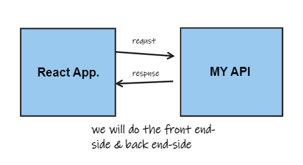

# city-explorer-api

**Author**: Noor Alkhateeb
**Version**: 1.0.0

## Overview

## Getting Started
1. Create a new repo called `city-explorer-api` on GitHub, initialized with a README file. Clone it
2. Run the command `Touch server.js` &
`npm init` to create a new project. 
3. Use `npm install` to add the required dependencies to this project: `express`, `dotenv`, and `cors`.
4. Manually add the remaining files  `.gitignore` and `.eslintrc.json`.

## Architecture
  * express framework
  * cors 
  * dotenv

## Changing Log

## data flow

## Credit and Collaborations
My partner [Razan Abdullah](https://github.com/Razan-abdullah),We Draw  the working methodology and flow of data.

## Time Estimates
**Name of feature** : Express Server API

**Estimate of time needed to complete**: 6 hours

**Start time** : 9:00pm

**Finish time** : ----

**Actual time needed to complete** : ---- hours